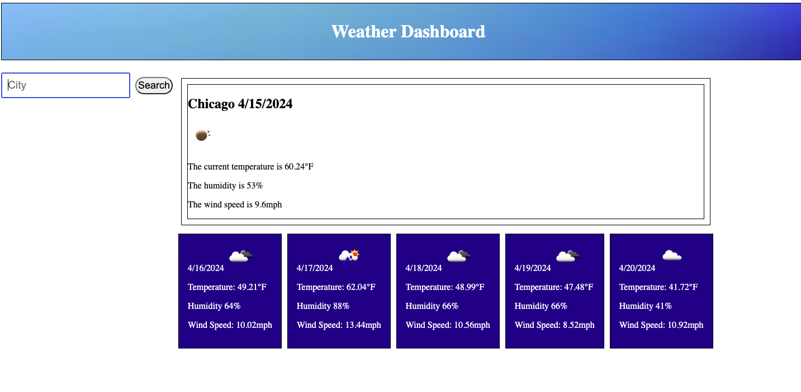

# Weather Dashboard
 

## Description
This [application](https://nvanschaack.github.io/weather-dashboard/) is a weather dashboard meant for anyone who needs the current weather and 5-day forecast for any city in the world! After searching any desired city, the user is able to immediately get access to important weather information, including the temperature, humidity, and wind speed.

## Technologies
- HTML5
- CSS3
- JavaScript (version ES6+)
- Bootstrap

## Usage
When the user loads the page, they will be able to search any desired city by typing it into the searchbar. After hitting the search button, the user will see the current weather in a large box, followed by a 5-day forecast in smaller boxes below. The user can repeat this process and see a list of recent searches aggregate below the searchbar incase they need quick access to a particular city's weather information again. 

## Credits
- [Bootstrap](https://getbootstrap.com/)
- [OpenWeather](https://openweathermap.org/)
- Collaboration with tutor, Vinnie Lopez (jlopez@instructors.2u.com)

## License
Please refer to the LICENSE in the repo.